# AI Interview Application — UML Design Models

## Document Control

| Field | Value |
| --- | --- |
| Document ID | MODEL-AI-INTERVIEW-001 |
| Version | 1.0 |
| Date | 2026-07-22 |
| Source Input | SPEC-AI-INTERVIEW-001 v1.0, DESIGN-AI-INTERVIEW-001 v1.0 |
| Status | Draft for architecture review |

---

## 1. Overview

This document provides comprehensive UML models and diagrams that visualize the AI Interview Application architecture, data flows, and interactions. These diagrams serve as the visual complement to the technical architecture and specification documents.

**Diagram Types Included:**
- System Context Diagram (C4 Level 1)
- Component Diagram (C4 Level 3)
- Deployment Diagram
- Data Flow Diagrams
- Entity Relationship Diagram (ERD)
- Sequence Diagrams for critical workflows

---

## 2. System Context Diagram

The system context diagram shows the AI Interview Application and its interactions with external actors and systems.

```plantuml
@startuml System Context
!include https://raw.githubusercontent.com/plantuml-stdlib/C4-PlantUML/master/C4_Context.puml

LAYOUT_WITH_LEGEND()

title System Context - AI Interview Application

Person(candidate, "Candidate", "External applicant applying for positions")
Person(recruiter, "Recruiter", "Internal staff managing interview processes")
Person(hr_reviewer, "HR Reviewer", "Internal staff reviewing AI screening results")
Person(tech_interviewer, "Technical Interviewer", "Internal staff conducting technical interviews")
Person(hr_manager, "HR Manager", "Internal staff making final hiring decisions")
Person(admin, "System Admin", "Internal staff managing system configuration")

System(ai_interview_app, "AI Interview Application", "Cloud-native hiring platform automating candidate screening and interview orchestration")

System_Ext(supabase_auth, "Supabase Auth", "Authentication and authorization service")
System_Ext(supabase_storage, "Supabase Storage", "Resume and document storage")
System_Ext(resend, "Resend", "Transactional email service")
System_Ext(assessment_provider, "Assessment Provider", "External aptitude and coding test platform")
System_Ext(grafana, "Grafana Cloud", "Observability and monitoring")

Rel(candidate, ai_interview_app, "Registers, applies, uploads resume, completes assessments", "HTTPS")
Rel(recruiter, ai_interview_app, "Manages interviews, communications, routing", "HTTPS")
Rel(hr_reviewer, ai_interview_app, "Reviews AI screening, shortlists candidates", "HTTPS")
Rel(tech_interviewer, ai_interview_app, "Conducts interviews, submits scorecards", "HTTPS")
Rel(hr_manager, ai_interview_app, "Makes final decisions, approves offers", "HTTPS")
Rel(admin, ai_interview_app, "Configures policies, manages users", "HTTPS")

Rel(ai_interview_app, supabase_auth, "Authenticates users, issues JWTs", "HTTPS/SDK")
Rel(ai_interview_app, supabase_storage, "Stores and retrieves files", "HTTPS/SDK")
Rel(ai_interview_app, resend, "Sends transactional emails", "HTTPS/REST")
Rel(ai_interview_app, assessment_provider, "Launches tests, receives scores", "HTTPS/REST + Webhook")
Rel(ai_interview_app, grafana, "Sends metrics, traces, logs", "OTLP")

@enduml
```

---

## 3. Component Diagram

The component diagram shows the internal structure of the AI Interview Application with its major components and their relationships.

```plantuml
@startuml Component Diagram
!include https://raw.githubusercontent.com/plantuml-stdlib/C4-PlantUML/master/C4_Component.puml

LAYOUT_WITH_LEGEND()

title Component Diagram - AI Interview Application

Container_Boundary(frontend, "Frontend Layer") {
    Component(webapp, "Web Application", "Next.js 14", "Candidate and internal user interfaces")
    Component(admin_panel, "Admin Panel", "Next.js 14", "System administration interface")
}

Container_Boundary(api_gateway, "API Gateway Layer") {
    Component(express_api, "REST API", "Express.js", "HTTP endpoints with authentication and validation")
    Component(websocket_server, "WebSocket Server", "Socket.io", "Real-time notifications and updates")
}

Container_Boundary(services, "Application Services Layer") {
    Component(auth_service, "Auth Service", "TypeScript", "Authentication and authorization logic")
    Component(candidate_service, "Candidate Service", "TypeScript", "Candidate profile and application management")
    Component(screening_service, "Screening Service", "TypeScript", "AI screening orchestration")
    Component(interview_service, "Interview Service", "TypeScript", "Interview scheduling and scorecard management")
    Component(decision_service, "Decision Service", "TypeScript", "Final decision and offer governance")
    Component(communication_service, "Communication Service", "TypeScript", "Email and notification dispatch")
}

Container_Boundary(workers, "Background Workers") {
    Component(ai_worker, "AI Worker", "Python", "Resume parsing and screening")
    Component(email_worker, "Email Worker", "TypeScript", "Email queue processing")
    Component(sla_worker, "SLA Monitor Worker", "TypeScript", "SLA breach detection and alerts")
    Component(analytics_worker, "Analytics Worker", "TypeScript", "Metrics aggregation")
}

Container_Boundary(data, "Data Layer") {
    ComponentDb(postgres, "PostgreSQL", "Supabase", "Primary relational database")
    ComponentDb(redis, "Redis", "Upstash", "Session cache and job queue")
    ComponentDb(object_storage, "Object Storage", "Supabase Storage", "Resume and document files")
}

Container_Boundary(external, "External Systems") {
    Component_Ext(supabase_auth, "Supabase Auth", "Authentication service")
    Component_Ext(resend_api, "Resend", "Email service")
    Component_Ext(assessment_api, "Assessment Provider", "Test platform")
}

Rel(webapp, express_api, "Makes API calls", "HTTPS/JSON")
Rel(webapp, websocket_server, "Subscribes to events", "WebSocket")
Rel(admin_panel, express_api, "Makes API calls", "HTTPS/JSON")

Rel(express_api, auth_service, "Validates authentication")
Rel(express_api, candidate_service, "Manages candidates")
Rel(express_api, screening_service, "Orchestrates screening")
Rel(express_api, interview_service, "Manages interviews")
Rel(express_api, decision_service, "Handles decisions")
Rel(express_api, communication_service, "Dispatches communications")

Rel(auth_service, supabase_auth, "Validates JWT", "SDK")
Rel(candidate_service, postgres, "Reads/writes data", "Prisma")
Rel(screening_service, redis, "Enqueues AI jobs", "BullMQ")
Rel(interview_service, postgres, "Reads/writes data", "Prisma")
Rel(decision_service, postgres, "Reads/writes data", "Prisma")
Rel(communication_service, redis, "Enqueues email jobs", "BullMQ")

Rel(ai_worker, redis, "Polls screening jobs", "BullMQ")
Rel(ai_worker, postgres, "Stores results", "Prisma")
Rel(ai_worker, object_storage, "Retrieves resumes", "SDK")

Rel(email_worker, redis, "Polls email jobs", "BullMQ")
Rel(email_worker, resend_api, "Sends emails", "HTTPS/REST")
Rel(email_worker, postgres, "Logs delivery status", "Prisma")

Rel(sla_worker, postgres, "Queries SLA data", "Prisma")
Rel(sla_worker, websocket_server, "Publishes alerts", "Socket.io")

Rel(analytics_worker, postgres, "Aggregates metrics", "Prisma")

@enduml
```

---

## 4. Deployment Diagram

The deployment diagram shows the physical deployment architecture across cloud infrastructure.

```plantuml
@startuml Deployment Diagram
!include https://raw.githubusercontent.com/plantuml-stdlib/C4-PlantUML/master/C4_Deployment.puml

LAYOUT_WITH_LEGEND()

title Deployment Diagram - AI Interview Application

Deployment_Node(vercel, "Vercel", "Edge Network") {
    Deployment_Node(cdn, "CDN", "Vercel Edge") {
        Container(frontend_app, "Frontend Application", "Next.js 14", "SSR + Static")
        Container(edge_functions, "Edge Functions", "Vercel Functions", "Rate limiting, auth checks")
    }
}

Deployment_Node(railway, "Railway.app", "Container Platform") {
    Deployment_Node(backend_container, "Backend Container", "Docker") {
        Container(api_server, "API Server", "Express.js", "REST endpoints")
        Container(websocket_srv, "WebSocket Server", "Socket.io", "Real-time events")
    }
    
    Deployment_Node(worker_container, "Worker Container", "Docker") {
        Container(ai_worker_srv, "AI Worker", "Python + FastAPI", "Resume parsing and screening")
    }
    
    Deployment_Node(bg_workers, "Background Workers", "Docker") {
        Container(email_worker_srv, "Email Worker", "Node.js", "Email queue processor")
        Container(sla_worker_srv, "SLA Worker", "Node.js", "SLA monitor")
        Container(analytics_worker_srv, "Analytics Worker", "Node.js", "Metrics aggregator")
    }
}

Deployment_Node(supabase, "Supabase", "Managed Database Platform") {
    Deployment_Node(postgres_cluster, "PostgreSQL Cluster", "PostgreSQL 15") {
        ContainerDb(primary_db, "Primary Database", "PostgreSQL", "Application data")
        ContainerDb(audit_db, "Audit Log", "PostgreSQL", "Immutable audit trail")
    }
    
    Deployment_Node(storage_cluster, "Storage Cluster", "S3-Compatible") {
        ContainerDb(file_storage, "Object Storage", "Supabase Storage", "Resumes and documents")
    }
    
    Container(auth_service, "Auth Service", "Supabase Auth", "JWT and OAuth")
}

Deployment_Node(upstash, "Upstash", "Serverless Redis") {
    ContainerDb(redis_cache, "Redis Cache", "Redis 7.x", "Sessions, queues, rate limits")
}

Deployment_Node(grafana_cloud, "Grafana Cloud", "Observability Platform") {
    Container(tempo, "Grafana Tempo", "Tracing", "Distributed traces")
    Container(prometheus, "Prometheus", "Metrics", "Business and system metrics")
    Container(loki, "Grafana Loki", "Logs", "Structured log aggregation")
}

Deployment_Node(github, "GitHub", "CI/CD Platform") {
    Container(actions, "GitHub Actions", "CI/CD", "Build, test, deploy")
}

Rel(frontend_app, api_server, "API calls", "HTTPS")
Rel(frontend_app, websocket_srv, "WebSocket", "WSS")
Rel(edge_functions, redis_cache, "Rate limiting", "HTTPS")

Rel(api_server, primary_db, "Queries", "PostgreSQL protocol")
Rel(api_server, redis_cache, "Cache operations", "Redis protocol")
Rel(api_server, auth_service, "JWT validation", "HTTPS")

Rel(ai_worker_srv, redis_cache, "Job polling", "BullMQ")
Rel(ai_worker_srv, primary_db, "Store results", "PostgreSQL protocol")
Rel(ai_worker_srv, file_storage, "Retrieve resumes", "HTTPS/S3")

Rel(email_worker_srv, redis_cache, "Job polling", "BullMQ")
Rel(sla_worker_srv, primary_db, "Query data", "PostgreSQL protocol")
Rel(analytics_worker_srv, primary_db, "Aggregate metrics", "PostgreSQL protocol")

Rel(api_server, tempo, "Traces", "OTLP/HTTPS")
Rel(api_server, prometheus, "Metrics", "OTLP/HTTPS")
Rel(api_server, loki, "Logs", "HTTPS")

Rel(actions, vercel, "Deploy frontend", "HTTPS")
Rel(actions, railway, "Deploy backend", "HTTPS")

@enduml
```

---

## 5. Data Flow Diagrams

### 5.1 Resume Upload and Screening Flow

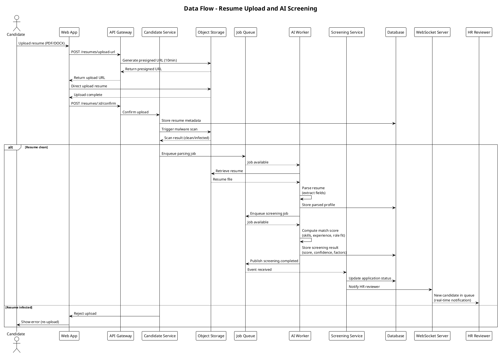
```plantuml
@startuml Resume Screening DFD
!theme plain
title Data Flow - Resume Upload and AI Screening

actor Candidate
participant "Web App" as WebApp
participant "API Gateway" as API
participant "Candidate Service" as CandidateService
participant "Object Storage" as Storage
participant "Job Queue" as Queue
participant "AI Worker" as AIWorker
participant "Screening Service" as ScreeningService
participant "Database" as DB
participant "WebSocket Server" as WS
participant "HR Reviewer" as HR

Candidate -> WebApp: Upload resume (PDF/DOCX)
WebApp -> API: POST /resumes/upload-url
API -> Storage: Generate presigned URL (10min)
Storage --> API: Return presigned URL
API --> WebApp: Return upload URL
WebApp -> Storage: Direct upload resume
Storage --> WebApp: Upload complete
WebApp -> API: POST /resumes/:id/confirm
API -> CandidateService: Confirm upload
CandidateService -> DB: Store resume metadata
CandidateService -> Storage: Trigger malware scan
Storage --> CandidateService: Scan result (clean/infected)
alt Resume clean
    CandidateService -> Queue: Enqueue parsing job
    Queue --> AIWorker: Job available
    AIWorker -> Storage: Retrieve resume
    Storage --> AIWorker: Resume file
    AIWorker -> AIWorker: Parse resume\n(extract fields)
    AIWorker -> DB: Store parsed profile
    AIWorker -> Queue: Enqueue screening job
    Queue --> AIWorker: Job available
    AIWorker -> AIWorker: Compute match score\n(skills, experience, role fit)
    AIWorker -> DB: Store screening result\n(score, confidence, factors)
    AIWorker -> Queue: Publish screening.completed
    Queue --> ScreeningService: Event received
    ScreeningService -> DB: Update application status
    ScreeningService -> WS: Notify HR reviewer
    WS --> HR: New candidate in queue\n(real-time notification)
else Resume infected
    CandidateService -> WebApp: Reject upload
    WebApp -> Candidate: Show error (re-upload)
end

@enduml
```

### 5.2 Interview Scheduling and Assessment Flow

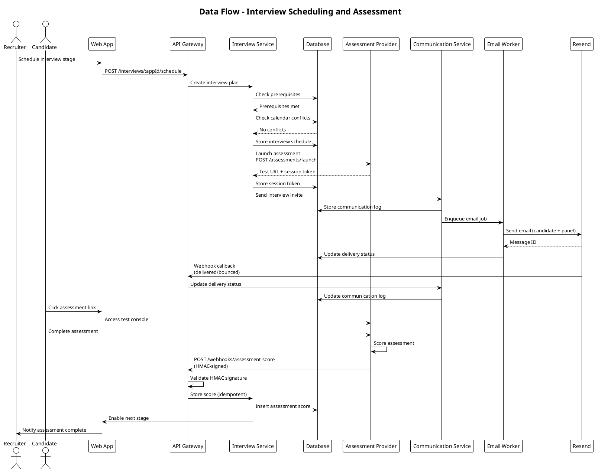
```plantuml
@startuml Interview Scheduling DFD
!theme plain
title Data Flow - Interview Scheduling and Assessment

actor Recruiter
actor Candidate
participant "Web App" as WebApp
participant "API Gateway" as API
participant "Interview Service" as InterviewService
participant "Database" as DB
participant "Assessment Provider" as Provider
participant "Communication Service" as CommService
participant "Email Worker" as EmailWorker
participant "Resend" as Resend

Recruiter -> WebApp: Schedule interview stage
WebApp -> API: POST /interviews/:appId/schedule
API -> InterviewService: Create interview plan
InterviewService -> DB: Check prerequisites
DB --> InterviewService: Prerequisites met
InterviewService -> DB: Check calendar conflicts
DB --> InterviewService: No conflicts
InterviewService -> DB: Store interview schedule
InterviewService -> Provider: Launch assessment\nPOST /assessments/launch
Provider --> InterviewService: Test URL + session token
InterviewService -> DB: Store session token
InterviewService -> CommService: Send interview invite
CommService -> DB: Store communication log
CommService -> EmailWorker: Enqueue email job
EmailWorker -> Resend: Send email (candidate + panel)
Resend --> EmailWorker: Message ID
EmailWorker -> DB: Update delivery status
Resend -> API: Webhook callback\n(delivered/bounced)
API -> CommService: Update delivery status
CommService -> DB: Update communication log

Candidate -> WebApp: Click assessment link
WebApp -> Provider: Access test console
Candidate -> Provider: Complete assessment
Provider -> Provider: Score assessment
Provider -> API: POST /webhooks/assessment-score\n(HMAC-signed)
API -> API: Validate HMAC signature
API -> InterviewService: Store score (idempotent)
InterviewService -> DB: Insert assessment score
InterviewService -> WebApp: Enable next stage
WebApp -> Recruiter: Notify assessment complete

@enduml
```

### 5.3 Decision and Offer Flow

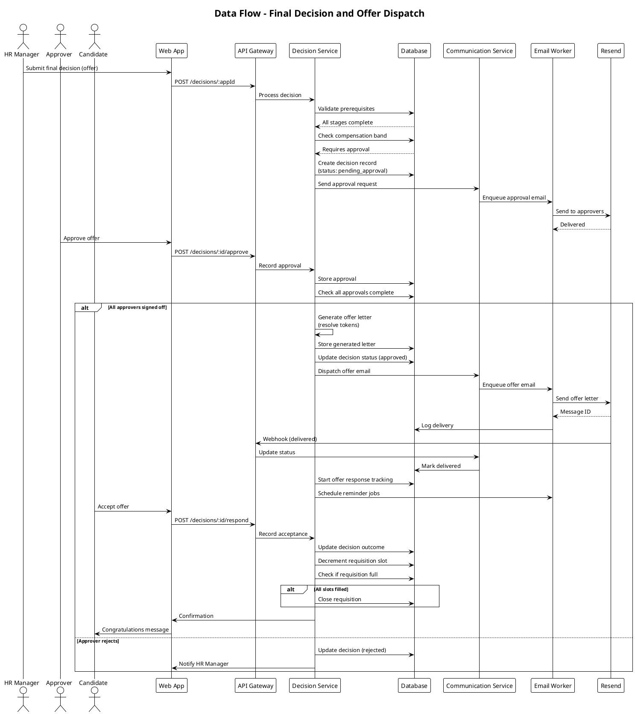
```plantuml
@startuml Decision Offer DFD
!theme plain
title Data Flow - Final Decision and Offer Dispatch

actor "HR Manager" as HRManager
actor Approver
actor Candidate
participant "Web App" as WebApp
participant "API Gateway" as API
participant "Decision Service" as DecisionService
participant "Database" as DB
participant "Communication Service" as CommService
participant "Email Worker" as EmailWorker
participant "Resend" as Resend

HRManager -> WebApp: Submit final decision (offer)
WebApp -> API: POST /decisions/:appId
API -> DecisionService: Process decision
DecisionService -> DB: Validate prerequisites
DB --> DecisionService: All stages complete
DecisionService -> DB: Check compensation band
DB --> DecisionService: Requires approval
DecisionService -> DB: Create decision record\n(status: pending_approval)
DecisionService -> CommService: Send approval request
CommService -> EmailWorker: Enqueue approval email
EmailWorker -> Resend: Send to approvers
Resend --> EmailWorker: Delivered

Approver -> WebApp: Approve offer
WebApp -> API: POST /decisions/:id/approve
API -> DecisionService: Record approval
DecisionService -> DB: Store approval
DecisionService -> DB: Check all approvals complete
alt All approvers signed off
    DecisionService -> DecisionService: Generate offer letter\n(resolve tokens)
    DecisionService -> DB: Store generated letter
    DecisionService -> DB: Update decision status (approved)
    DecisionService -> CommService: Dispatch offer email
    CommService -> EmailWorker: Enqueue offer email
    EmailWorker -> Resend: Send offer letter
    Resend --> EmailWorker: Message ID
    EmailWorker -> DB: Log delivery
    Resend -> API: Webhook (delivered)
    API -> CommService: Update status
    CommService -> DB: Mark delivered
    
    DecisionService -> DB: Start offer response tracking
    DecisionService -> EmailWorker: Schedule reminder jobs
    
    Candidate -> WebApp: Accept offer
    WebApp -> API: POST /decisions/:id/respond
    API -> DecisionService: Record acceptance
    DecisionService -> DB: Update decision outcome
    DecisionService -> DB: Decrement requisition slot
    DecisionService -> DB: Check if requisition full
    alt All slots filled
        DecisionService -> DB: Close requisition
    end
    DecisionService -> WebApp: Confirmation
    WebApp -> Candidate: Congratulations message
else Approver rejects
    DecisionService -> DB: Update decision (rejected)
    DecisionService -> WebApp: Notify HR Manager
end

@enduml
```

---

## 6. Entity Relationship Diagram (ERD)

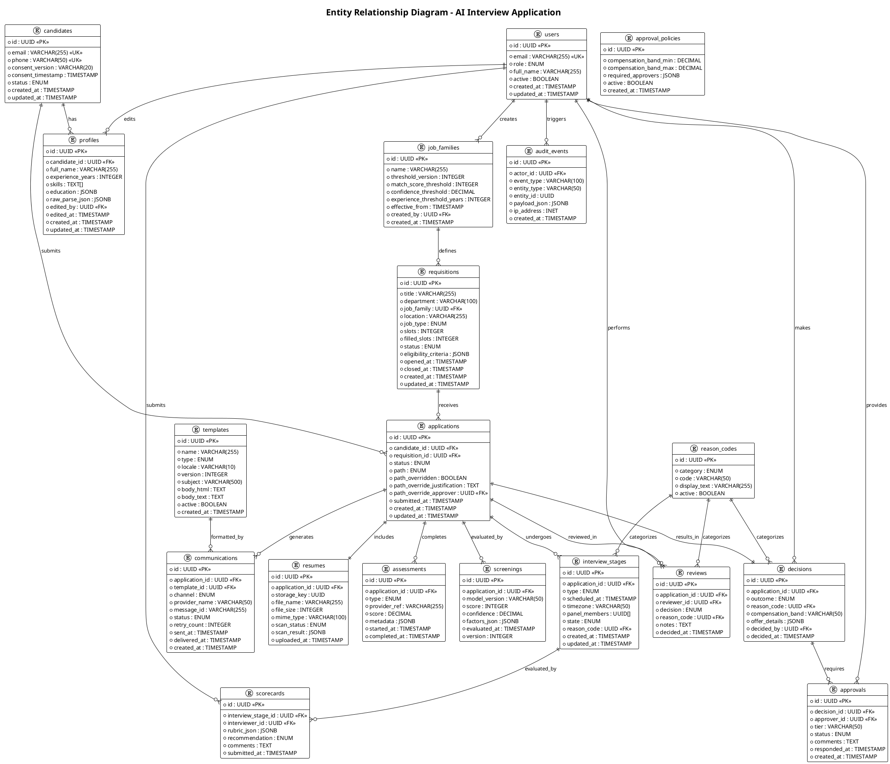
```plantuml
@startuml Entity Relationship Diagram
!theme plain
title Entity Relationship Diagram - AI Interview Application

' Entities and their attributes
entity "candidates" as candidates {
  * id : UUID <<PK>>
  --
  * email : VARCHAR(255) <<UK>>
  * phone : VARCHAR(50) <<UK>>
  * consent_version : VARCHAR(20)
  * consent_timestamp : TIMESTAMP
  * status : ENUM
  * created_at : TIMESTAMP
  * updated_at : TIMESTAMP
}

entity "profiles" as profiles {
  * id : UUID <<PK>>
  --
  * candidate_id : UUID <<FK>>
  * full_name : VARCHAR(255)
  * experience_years : INTEGER
  * skills : TEXT[]
  * education : JSONB
  * raw_parse_json : JSONB
  * edited_by : UUID <<FK>>
  * edited_at : TIMESTAMP
  * created_at : TIMESTAMP
  * updated_at : TIMESTAMP
}

entity "requisitions" as requisitions {
  * id : UUID <<PK>>
  --
  * title : VARCHAR(255)
  * department : VARCHAR(100)
  * job_family : UUID <<FK>>
  * location : VARCHAR(255)
  * job_type : ENUM
  * slots : INTEGER
  * filled_slots : INTEGER
  * status : ENUM
  * eligibility_criteria : JSONB
  * opened_at : TIMESTAMP
  * closed_at : TIMESTAMP
  * created_at : TIMESTAMP
  * updated_at : TIMESTAMP
}

entity "applications" as applications {
  * id : UUID <<PK>>
  --
  * candidate_id : UUID <<FK>>
  * requisition_id : UUID <<FK>>
  * status : ENUM
  * path : ENUM
  * path_overridden : BOOLEAN
  * path_override_justification : TEXT
  * path_override_approver : UUID <<FK>>
  * submitted_at : TIMESTAMP
  * created_at : TIMESTAMP
  * updated_at : TIMESTAMP
}

entity "resumes" as resumes {
  * id : UUID <<PK>>
  --
  * application_id : UUID <<FK>>
  * storage_key : UUID
  * file_name : VARCHAR(255)
  * file_size : INTEGER
  * mime_type : VARCHAR(100)
  * scan_status : ENUM
  * scan_result : JSONB
  * uploaded_at : TIMESTAMP
}

entity "screenings" as screenings {
  * id : UUID <<PK>>
  --
  * application_id : UUID <<FK>>
  * model_version : VARCHAR(50)
  * score : INTEGER
  * confidence : DECIMAL
  * factors_json : JSONB
  * evaluated_at : TIMESTAMP
  * version : INTEGER
}

entity "reviews" as reviews {
  * id : UUID <<PK>>
  --
  * application_id : UUID <<FK>>
  * reviewer_id : UUID <<FK>>
  * decision : ENUM
  * reason_code : UUID <<FK>>
  * notes : TEXT
  * decided_at : TIMESTAMP
}

entity "assessments" as assessments {
  * id : UUID <<PK>>
  --
  * application_id : UUID <<FK>>
  * type : ENUM
  * provider_ref : VARCHAR(255)
  * score : DECIMAL
  * metadata : JSONB
  * started_at : TIMESTAMP
  * completed_at : TIMESTAMP
}

entity "interview_stages" as interview_stages {
  * id : UUID <<PK>>
  --
  * application_id : UUID <<FK>>
  * type : ENUM
  * scheduled_at : TIMESTAMP
  * timezone : VARCHAR(50)
  * panel_members : UUID[]
  * state : ENUM
  * reason_code : UUID <<FK>>
  * created_at : TIMESTAMP
  * updated_at : TIMESTAMP
}

entity "scorecards" as scorecards {
  * id : UUID <<PK>>
  --
  * interview_stage_id : UUID <<FK>>
  * interviewer_id : UUID <<FK>>
  * rubric_json : JSONB
  * recommendation : ENUM
  * comments : TEXT
  * submitted_at : TIMESTAMP
}

entity "decisions" as decisions {
  * id : UUID <<PK>>
  --
  * application_id : UUID <<FK>>
  * outcome : ENUM
  * reason_code : UUID <<FK>>
  * compensation_band : VARCHAR(50)
  * offer_details : JSONB
  * decided_by : UUID <<FK>>
  * decided_at : TIMESTAMP
}

entity "approvals" as approvals {
  * id : UUID <<PK>>
  --
  * decision_id : UUID <<FK>>
  * approver_id : UUID <<FK>>
  * tier : VARCHAR(50)
  * status : ENUM
  * comments : TEXT
  * responded_at : TIMESTAMP
  * created_at : TIMESTAMP
}

entity "communications" as communications {
  * id : UUID <<PK>>
  --
  * application_id : UUID <<FK>>
  * template_id : UUID <<FK>>
  * channel : ENUM
  * provider_name : VARCHAR(50)
  * message_id : VARCHAR(255)
  * status : ENUM
  * retry_count : INTEGER
  * sent_at : TIMESTAMP
  * delivered_at : TIMESTAMP
  * created_at : TIMESTAMP
}

entity "audit_events" as audit_events {
  * id : UUID <<PK>>
  --
  * actor_id : UUID <<FK>>
  * event_type : VARCHAR(100)
  * entity_type : VARCHAR(50)
  * entity_id : UUID
  * payload_json : JSONB
  * ip_address : INET
  * created_at : TIMESTAMP
}

entity "job_families" as job_families {
  * id : UUID <<PK>>
  --
  * name : VARCHAR(255)
  * threshold_version : INTEGER
  * match_score_threshold : INTEGER
  * confidence_threshold : DECIMAL
  * experience_threshold_years : INTEGER
  * effective_from : TIMESTAMP
  * created_by : UUID <<FK>>
  * created_at : TIMESTAMP
}

entity "templates" as templates {
  * id : UUID <<PK>>
  --
  * name : VARCHAR(255)
  * type : ENUM
  * locale : VARCHAR(10)
  * version : INTEGER
  * subject : VARCHAR(500)
  * body_html : TEXT
  * body_text : TEXT
  * active : BOOLEAN
  * created_at : TIMESTAMP
}

entity "reason_codes" as reason_codes {
  * id : UUID <<PK>>
  --
  * category : ENUM
  * code : VARCHAR(50)
  * display_text : VARCHAR(255)
  * active : BOOLEAN
}

entity "approval_policies" as approval_policies {
  * id : UUID <<PK>>
  --
  * compensation_band_min : DECIMAL
  * compensation_band_max : DECIMAL
  * required_approvers : JSONB
  * active : BOOLEAN
  * created_at : TIMESTAMP
}

entity "users" as users {
  * id : UUID <<PK>>
  --
  * email : VARCHAR(255) <<UK>>
  * role : ENUM
  * full_name : VARCHAR(255)
  * active : BOOLEAN
  * created_at : TIMESTAMP
  * updated_at : TIMESTAMP
}

' Relationships
candidates ||--o{ profiles : "has"
candidates ||--o{ applications : "submits"
requisitions ||--o{ applications : "receives"
job_families ||--o{ requisitions : "defines"
applications ||--|| resumes : "includes"
applications ||--o{ screenings : "evaluated_by"
applications ||--o{ reviews : "reviewed_in"
applications ||--o{ assessments : "completes"
applications ||--o{ interview_stages : "undergoes"
applications ||--|| decisions : "results_in"
applications ||--o{ communications : "generates"
interview_stages ||--o{ scorecards : "evaluated_by"
decisions ||--o{ approvals : "requires"
templates ||--o{ communications : "formatted_by"
reason_codes ||--o{ reviews : "categorizes"
reason_codes ||--o{ decisions : "categorizes"
reason_codes ||--o{ interview_stages : "categorizes"
users ||--o{ reviews : "performs"
users ||--o{ scorecards : "submits"
users ||--o{ decisions : "makes"
users ||--o{ approvals : "provides"
users ||--o{ profiles : "edits"
users ||--o{ job_families : "creates"
users ||--o{ audit_events : "triggers"

@enduml
```

---

## 7. Sequence Diagrams

### 7.1 Candidate Registration and Application Sequence

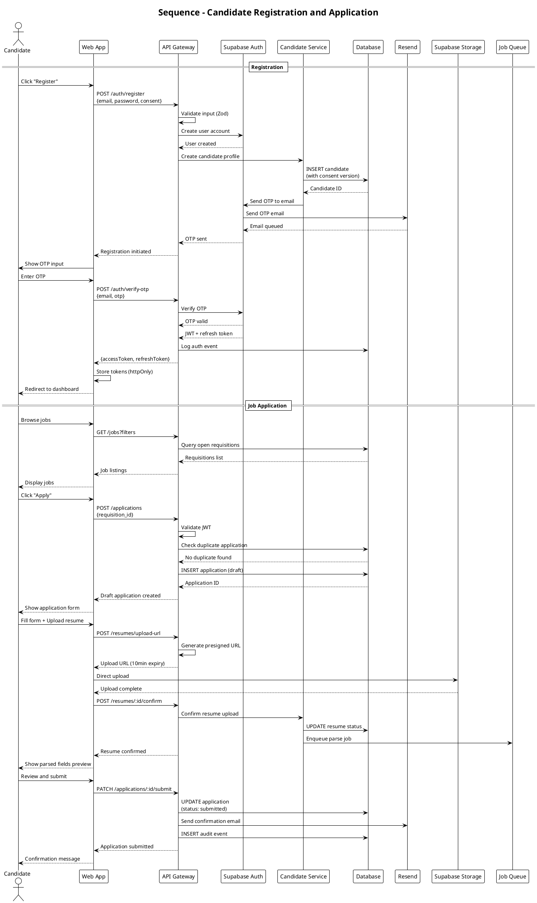
```plantuml
@startuml Registration Sequence
!theme plain
title Sequence - Candidate Registration and Application

actor Candidate
participant "Web App" as WebApp
participant "API Gateway" as API
participant "Supabase Auth" as Auth
participant "Candidate Service" as CandidateService
participant "Database" as DB
participant "Resend" as Email

== Registration ==
Candidate -> WebApp: Click "Register"
WebApp -> API: POST /auth/register\n{email, password, consent}
API -> API: Validate input (Zod)
API -> Auth: Create user account
Auth --> API: User created
API -> CandidateService: Create candidate profile
CandidateService -> DB: INSERT candidate\n(with consent version)
DB --> CandidateService: Candidate ID
CandidateService -> Auth: Send OTP to email
Auth -> Email: Send OTP email
Email --> Auth: Email queued
Auth --> API: OTP sent
API --> WebApp: Registration initiated
WebApp -> Candidate: Show OTP input

Candidate -> WebApp: Enter OTP
WebApp -> API: POST /auth/verify-otp\n{email, otp}
API -> Auth: Verify OTP
Auth --> API: OTP valid
Auth --> API: JWT + refresh token
API -> DB: Log auth event
API --> WebApp: {accessToken, refreshToken}
WebApp -> WebApp: Store tokens (httpOnly)
WebApp --> Candidate: Redirect to dashboard

== Job Application ==
Candidate -> WebApp: Browse jobs
WebApp -> API: GET /jobs?filters
API -> DB: Query open requisitions
DB --> API: Requisitions list
API --> WebApp: Job listings
WebApp --> Candidate: Display jobs

Candidate -> WebApp: Click "Apply"
WebApp -> API: POST /applications\n{requisition_id}
API -> API: Validate JWT
API -> DB: Check duplicate application
DB --> API: No duplicate found
API -> DB: INSERT application (draft)
DB --> API: Application ID
API --> WebApp: Draft application created
WebApp --> Candidate: Show application form

Candidate -> WebApp: Fill form + Upload resume
WebApp -> API: POST /resumes/upload-url
API -> API: Generate presigned URL
API --> WebApp: Upload URL (10min expiry)
WebApp -> "Supabase Storage" as Storage: Direct upload
Storage --> WebApp: Upload complete
WebApp -> API: POST /resumes/:id/confirm
API -> CandidateService: Confirm resume upload
CandidateService -> DB: UPDATE resume status
CandidateService -> "Job Queue" as Queue: Enqueue parse job
API --> WebApp: Resume confirmed
WebApp --> Candidate: Show parsed fields preview

Candidate -> WebApp: Review and submit
WebApp -> API: PATCH /applications/:id/submit
API -> DB: UPDATE application\n(status: submitted)
API -> Email: Send confirmation email
API -> DB: INSERT audit event
API --> WebApp: Application submitted
WebApp --> Candidate: Confirmation message

@enduml
```

### 7.2 HR Review and Shortlist Sequence

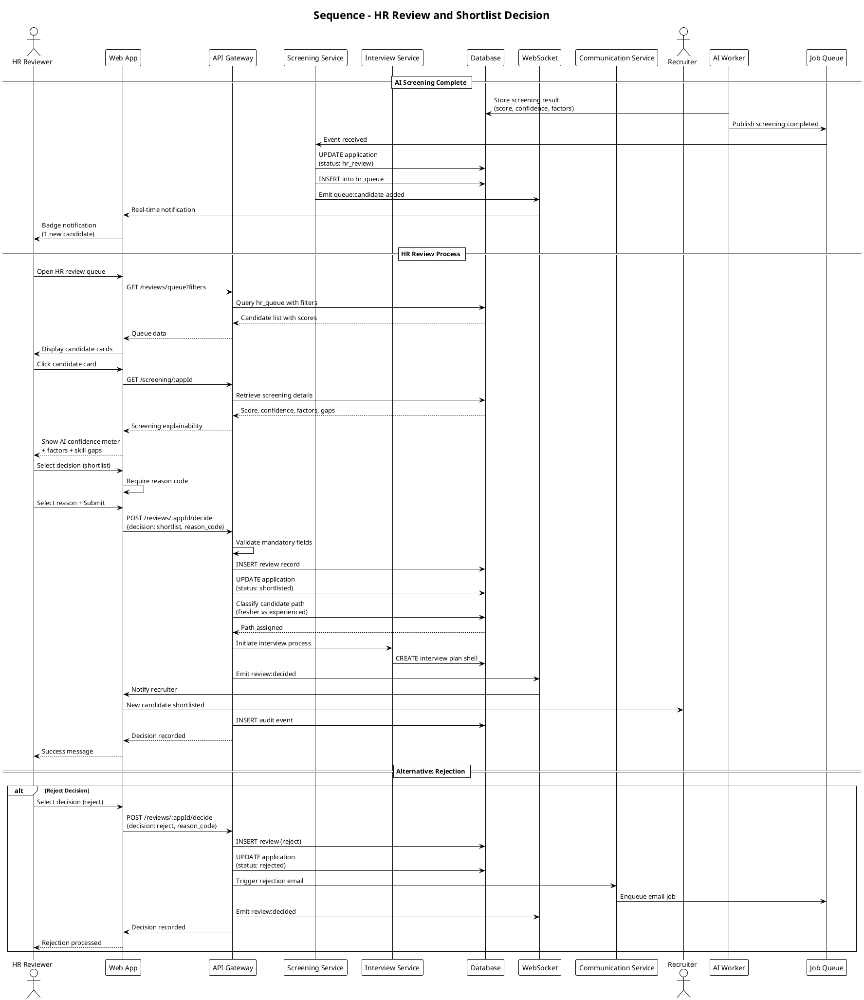
```plantuml
@startuml HR Review Sequence
!theme plain
title Sequence - HR Review and Shortlist Decision

actor "HR Reviewer" as HR
participant "Web App" as WebApp
participant "API Gateway" as API
participant "Screening Service" as ScreeningService
participant "Interview Service" as InterviewService
participant "Database" as DB
participant "WebSocket" as WS
participant "Communication Service" as CommService
actor Recruiter

== AI Screening Complete ==
"AI Worker" as AIWorker -> DB: Store screening result\n(score, confidence, factors)
AIWorker -> "Job Queue" as Queue: Publish screening.completed
Queue -> ScreeningService: Event received
ScreeningService -> DB: UPDATE application\n(status: hr_review)
ScreeningService -> DB: INSERT into hr_queue
ScreeningService -> WS: Emit queue:candidate-added
WS -> WebApp: Real-time notification
WebApp -> HR: Badge notification\n(1 new candidate)

== HR Review Process ==
HR -> WebApp: Open HR review queue
WebApp -> API: GET /reviews/queue?filters
API -> DB: Query hr_queue with filters
DB --> API: Candidate list with scores
API --> WebApp: Queue data
WebApp --> HR: Display candidate cards

HR -> WebApp: Click candidate card
WebApp -> API: GET /screening/:appId
API -> DB: Retrieve screening details
DB --> API: Score, confidence, factors, gaps
API --> WebApp: Screening explainability
WebApp --> HR: Show AI confidence meter\n+ factors + skill gaps

HR -> WebApp: Select decision (shortlist)
WebApp -> WebApp: Require reason code
HR -> WebApp: Select reason + Submit
WebApp -> API: POST /reviews/:appId/decide\n{decision: shortlist, reason_code}
API -> API: Validate mandatory fields
API -> DB: INSERT review record
API -> DB: UPDATE application\n(status: shortlisted)
API -> DB: Classify candidate path\n(fresher vs experienced)
DB --> API: Path assigned
API -> InterviewService: Initiate interview process
InterviewService -> DB: CREATE interview plan shell
API -> WS: Emit review:decided
WS -> WebApp: Notify recruiter
WebApp -> Recruiter: New candidate shortlisted
API -> DB: INSERT audit event
API --> WebApp: Decision recorded
WebApp --> HR: Success message

== Alternative: Rejection ==
alt Reject Decision
    HR -> WebApp: Select decision (reject)
    WebApp -> API: POST /reviews/:appId/decide\n{decision: reject, reason_code}
    API -> DB: INSERT review (reject)
    API -> DB: UPDATE application\n(status: rejected)
    API -> CommService: Trigger rejection email
    CommService -> Queue: Enqueue email job
    API -> WS: Emit review:decided
    API --> WebApp: Decision recorded
    WebApp --> HR: Rejection processed
end

@enduml
```

### 7.3 Interview Scheduling and Scorecard Sequence

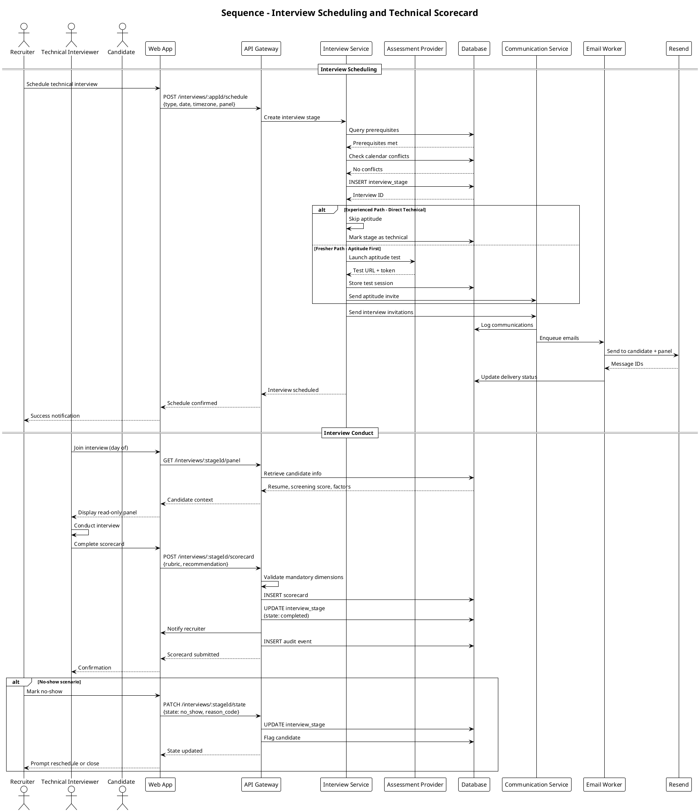
```plantuml
@startuml Interview Sequence
!theme plain
title Sequence - Interview Scheduling and Technical Scorecard

actor Recruiter
actor "Technical Interviewer" as TechInterviewer
actor Candidate
participant "Web App" as WebApp
participant "API Gateway" as API
participant "Interview Service" as InterviewService
participant "Assessment Provider" as Provider
participant "Database" as DB
participant "Communication Service" as CommService

== Interview Scheduling ==
Recruiter -> WebApp: Schedule technical interview
WebApp -> API: POST /interviews/:appId/schedule\n{type, date, timezone, panel}
API -> InterviewService: Create interview stage
InterviewService -> DB: Query prerequisites
DB --> InterviewService: Prerequisites met
InterviewService -> DB: Check calendar conflicts
DB --> InterviewService: No conflicts
InterviewService -> DB: INSERT interview_stage
DB --> InterviewService: Interview ID

alt Experienced Path - Direct Technical
    InterviewService -> InterviewService: Skip aptitude
    InterviewService -> DB: Mark stage as technical
else Fresher Path - Aptitude First
    InterviewService -> Provider: Launch aptitude test
    Provider --> InterviewService: Test URL + token
    InterviewService -> DB: Store test session
    InterviewService -> CommService: Send aptitude invite
end

InterviewService -> CommService: Send interview invitations
CommService -> DB: Log communications
CommService -> "Email Worker" as EmailWorker: Enqueue emails
EmailWorker -> "Resend" as Resend: Send to candidate + panel
Resend --> EmailWorker: Message IDs
EmailWorker -> DB: Update delivery status

InterviewService --> API: Interview scheduled
API --> WebApp: Schedule confirmed
WebApp --> Recruiter: Success notification

== Interview Conduct ==
TechInterviewer -> WebApp: Join interview (day of)
WebApp -> API: GET /interviews/:stageId/panel
API -> DB: Retrieve candidate info
DB --> API: Resume, screening score, factors
API --> WebApp: Candidate context
WebApp --> TechInterviewer: Display read-only panel

TechInterviewer -> TechInterviewer: Conduct interview
TechInterviewer -> WebApp: Complete scorecard
WebApp -> API: POST /interviews/:stageId/scorecard\n{rubric, recommendation}
API -> API: Validate mandatory dimensions
API -> DB: INSERT scorecard
API -> DB: UPDATE interview_stage\n(state: completed)
API -> WebApp: Notify recruiter
API -> DB: INSERT audit event
API --> WebApp: Scorecard submitted
WebApp --> TechInterviewer: Confirmation

alt No-show scenario
    Recruiter -> WebApp: Mark no-show
    WebApp -> API: PATCH /interviews/:stageId/state\n{state: no_show, reason_code}
    API -> DB: UPDATE interview_stage
    API -> DB: Flag candidate
    API --> WebApp: State updated
    WebApp --> Recruiter: Prompt reschedule or close
end

@enduml
```

### 7.4 Final Decision and Offer Sequence

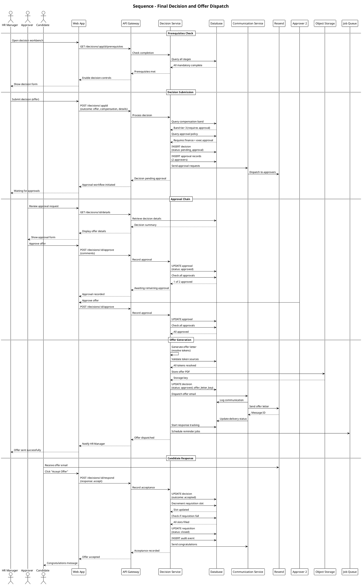
```plantuml
@startuml Decision Offer Sequence
!theme plain
title Sequence - Final Decision and Offer Dispatch

actor "HR Manager" as HRManager
actor Approver
actor Candidate
participant "Web App" as WebApp
participant "API Gateway" as API
participant "Decision Service" as DecisionService
participant "Database" as DB
participant "Communication Service" as CommService
participant "Resend" as Email

== Prerequisites Check ==
HRManager -> WebApp: Open decision workbench
WebApp -> API: GET /decisions/:appId/prerequisites
API -> DecisionService: Check completion
DecisionService -> DB: Query all stages
DB --> DecisionService: All mandatory complete
DecisionService --> API: Prerequisites met
API --> WebApp: Enable decision controls
WebApp --> HRManager: Show decision form

== Decision Submission ==
HRManager -> WebApp: Submit decision (offer)
WebApp -> API: POST /decisions/:appId\n{outcome: offer, compensation, details}
API -> DecisionService: Process decision
DecisionService -> DB: Query compensation band
DB --> DecisionService: Band tier 3 (requires approval)
DecisionService -> DB: Query approval policy
DB --> DecisionService: Requires finance + exec approval
DecisionService -> DB: INSERT decision\n(status: pending_approval)
DecisionService -> DB: INSERT approval records\n(2 approvers)
DecisionService -> CommService: Send approval requests
CommService -> Email: Dispatch to approvers
DecisionService --> API: Decision pending approval
API --> WebApp: Approval workflow initiated
WebApp --> HRManager: Waiting for approvals

== Approval Chain ==
Approver -> WebApp: Review approval request
WebApp -> API: GET /decisions/:id/details
API -> DB: Retrieve decision details
DB --> API: Decision summary
API --> WebApp: Display offer details
WebApp --> Approver: Show approval form

Approver -> WebApp: Approve offer
WebApp -> API: POST /decisions/:id/approve\n{comments}
API -> DecisionService: Record approval
DecisionService -> DB: UPDATE approval\n(status: approved)
DecisionService -> DB: Check all approvals
DB --> DecisionService: 1 of 2 approved
DecisionService --> API: Awaiting remaining approval
API --> WebApp: Approval recorded

"Approver 2" as Approver2 -> WebApp: Approve offer
WebApp -> API: POST /decisions/:id/approve
API -> DecisionService: Record approval
DecisionService -> DB: UPDATE approval
DecisionService -> DB: Check all approvals
DB --> DecisionService: All approved

== Offer Generation ==
DecisionService -> DecisionService: Generate offer letter\n(resolve tokens)
DecisionService -> DB: Validate token sources
DB --> DecisionService: All tokens resolved
DecisionService -> "Object Storage" as Storage: Store offer PDF
Storage --> DecisionService: Storage key
DecisionService -> DB: UPDATE decision\n(status: approved, offer_letter_key)
DecisionService -> CommService: Dispatch offer email
CommService -> DB: Log communication
CommService -> Email: Send offer letter
Email --> CommService: Message ID
CommService -> DB: Update delivery status

DecisionService -> DB: Start response tracking
DecisionService -> "Job Queue" as Queue: Schedule reminder jobs
DecisionService --> API: Offer dispatched
API --> WebApp: Notify HR Manager
WebApp --> HRManager: Offer sent successfully

== Candidate Response ==
Candidate -> Email: Receive offer email
Candidate -> WebApp: Click "Accept Offer"
WebApp -> API: POST /decisions/:id/respond\n{response: accept}
API -> DecisionService: Record acceptance
DecisionService -> DB: UPDATE decision\n(outcome: accepted)
DecisionService -> DB: Decrement requisition slot
DB --> DecisionService: Slot updated
DecisionService -> DB: Check if requisition full
DB --> DecisionService: All slots filled
DecisionService -> DB: UPDATE requisition\n(status: closed)
DecisionService -> DB: INSERT audit event
DecisionService -> CommService: Send congratulations
DecisionService --> API: Acceptance recorded
API --> WebApp: Offer accepted
WebApp --> Candidate: Congratulations message

@enduml
```

---

## 8. State Machine Diagrams

### 8.1 Application State Machine

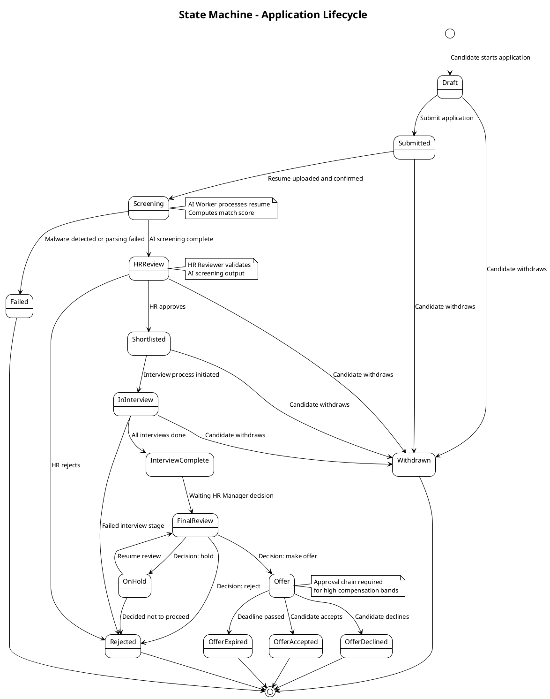
```plantuml
@startuml Application State Machine
!theme plain
title State Machine - Application Lifecycle

[*] --> Draft : Candidate starts application

Draft --> Submitted : Submit application
Draft --> Withdrawn : Candidate withdraws

Submitted --> Screening : Resume uploaded and confirmed
Submitted --> Withdrawn : Candidate withdraws

Screening --> HRReview : AI screening complete
Screening --> Failed : Malware detected or parsing failed

HRReview --> Shortlisted : HR approves
HRReview --> Rejected : HR rejects
HRReview --> Withdrawn : Candidate withdraws

Shortlisted --> InInterview : Interview process initiated
Shortlisted --> Withdrawn : Candidate withdraws

InInterview --> InterviewComplete : All interviews done
InInterview --> Rejected : Failed interview stage
InInterview --> Withdrawn : Candidate withdraws

InterviewComplete --> FinalReview : Waiting HR Manager decision
FinalReview --> Offer : Decision: make offer
FinalReview --> Rejected : Decision: reject
FinalReview --> OnHold : Decision: hold

Offer --> OfferAccepted : Candidate accepts
Offer --> OfferDeclined : Candidate declines
Offer --> OfferExpired : Deadline passed

OnHold --> FinalReview : Resume review
OnHold --> Rejected : Decided not to proceed

OfferAccepted --> [*]
OfferDeclined --> [*]
OfferExpired --> [*]
Rejected --> [*]
Withdrawn --> [*]
Failed --> [*]

note right of Screening
  AI Worker processes resume
  Computes match score
end note

note right of HRReview
  HR Reviewer validates
  AI screening output
end note

note right of Offer
  Approval chain required
  for high compensation bands
end note

@enduml
```

### 8.2 Interview Stage State Machine

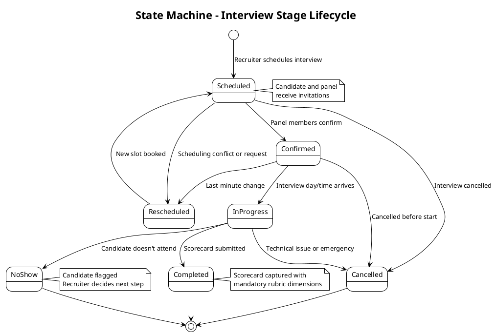
```plantuml
@startuml Interview Stage State Machine
!theme plain
title State Machine - Interview Stage Lifecycle

[*] --> Scheduled : Recruiter schedules interview

Scheduled --> Confirmed : Panel members confirm
Scheduled --> Rescheduled : Scheduling conflict or request
Scheduled --> Cancelled : Interview cancelled

Confirmed --> InProgress : Interview day/time arrives
Confirmed --> Rescheduled : Last-minute change
Confirmed --> Cancelled : Cancelled before start

InProgress --> Completed : Scorecard submitted
InProgress --> NoShow : Candidate doesn't attend
InProgress --> Cancelled : Technical issue or emergency

Rescheduled --> Scheduled : New slot booked
Cancelled --> [*]
NoShow --> [*]

Completed --> [*]

note right of Scheduled
  Candidate and panel
  receive invitations
end note

note right of NoShow
  Candidate flagged
  Recruiter decides next step
end note

note right of Completed
  Scorecard captured with
  mandatory rubric dimensions
end note

@enduml
```

---

## 9. Class Diagrams

### 9.1 Domain Model - Core Classes

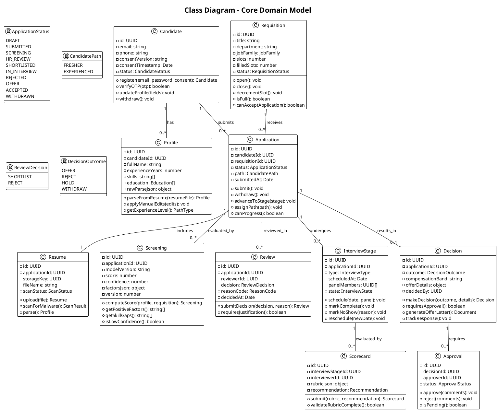
```plantuml
@startuml Domain Model
!theme plain
title Class Diagram - Core Domain Model

class Candidate {
  - id: UUID
  - email: string
  - phone: string
  - consentVersion: string
  - consentTimestamp: Date
  - status: CandidateStatus
  + register(email, password, consent): Candidate
  + verifyOTP(otp): boolean
  + updateProfile(fields): void
  + withdraw(): void
}

class Profile {
  - id: UUID
  - candidateId: UUID
  - fullName: string
  - experienceYears: number
  - skills: string[]
  - education: Education[]
  - rawParseJson: object
  + parseFromResume(resumeFile): Profile
  + applyManualEdits(edits): void
  + getExperienceLevel(): PathType
}

class Requisition {
  - id: UUID
  - title: string
  - department: string
  - jobFamily: JobFamily
  - slots: number
  - filledSlots: number
  - status: RequisitionStatus
  + open(): void
  + close(): void
  + decrementSlot(): void
  + isFull(): boolean
  + canAcceptApplication(): boolean
}

class Application {
  - id: UUID
  - candidateId: UUID
  - requisitionId: UUID
  - status: ApplicationStatus
  - path: CandidatePath
  - submittedAt: Date
  + submit(): void
  + withdraw(): void
  + advanceToStage(stage): void
  + assignPath(path): void
  + canProgress(): boolean
}

class Resume {
  - id: UUID
  - applicationId: UUID
  - storageKey: UUID
  - fileName: string
  - scanStatus: ScanStatus
  + upload(file): Resume
  + scanForMalware(): ScanResult
  + parse(): Profile
}

class Screening {
  - id: UUID
  - applicationId: UUID
  - modelVersion: string
  - score: number
  - confidence: number
  - factorsJson: object
  - version: number
  + computeScore(profile, requisition): Screening
  + getPositiveFactors(): string[]
  + getSkillGaps(): string[]
  + isLowConfidence(): boolean
}

class Review {
  - id: UUID
  - applicationId: UUID
  - reviewerId: UUID
  - decision: ReviewDecision
  - reasonCode: ReasonCode
  - decidedAt: Date
  + submitDecision(decision, reason): Review
  + requiresJustification(): boolean
}

class InterviewStage {
  - id: UUID
  - applicationId: UUID
  - type: InterviewType
  - scheduledAt: Date
  - panelMembers: UUID[]
  - state: InterviewState
  + schedule(date, panel): void
  + markComplete(): void
  + markNoShow(reason): void
  + reschedule(newDate): void
}

class Scorecard {
  - id: UUID
  - interviewStageId: UUID
  - interviewerId: UUID
  - rubricJson: object
  - recommendation: Recommendation
  + submit(rubric, recommendation): Scorecard
  + validateRubricComplete(): boolean
}

class Decision {
  - id: UUID
  - applicationId: UUID
  - outcome: DecisionOutcome
  - compensationBand: string
  - offerDetails: object
  - decidedBy: UUID
  + makeDecision(outcome, details): Decision
  + requiresApproval(): boolean
  + generateOfferLetter(): Document
  + trackResponse(): void
}

class Approval {
  - id: UUID
  - decisionId: UUID
  - approverId: UUID
  - status: ApprovalStatus
  + approve(comments): void
  + reject(comments): void
  + isPending(): boolean
}

enum ApplicationStatus {
  DRAFT
  SUBMITTED
  SCREENING
  HR_REVIEW
  SHORTLISTED
  IN_INTERVIEW
  REJECTED
  OFFER
  ACCEPTED
  WITHDRAWN
}

enum CandidatePath {
  FRESHER
  EXPERIENCED
}

enum ReviewDecision {
  SHORTLIST
  REJECT
}

enum DecisionOutcome {
  OFFER
  REJECT
  HOLD
  WITHDRAW
}

' Relationships
Candidate "1" -- "0..*" Profile : has
Candidate "1" -- "0..*" Application : submits
Requisition "1" -- "0..*" Application : receives
Application "1" -- "1" Resume : includes
Application "1" -- "0..*" Screening : evaluated_by
Application "1" -- "0..*" Review : reviewed_in
Application "1" -- "0..*" InterviewStage : undergoes
Application "1" -- "0..1" Decision : results_in
InterviewStage "1" -- "0..*" Scorecard : evaluated_by
Decision "1" -- "0..*" Approval : requires

@enduml
```

---

## 10. Timing Diagrams

### 10.1 SLA Monitoring and Alerting

```plantuml
@startuml SLA Timing
!theme plain
title Timing Diagram - SLA Monitoring and Alerting

robust "Application" as App
concise "HR Review Queue" as Queue
concise "SLA Monitor" as SLA
concise "Alert System" as Alert

@0
App is Submitted
Queue is Pending
SLA is Monitoring
Alert is Idle

@2400
Queue is InReview
note bottom: HR Reviewer opens card

@3600
SLA is CheckingSLA
note bottom: 1 hour check

@7200
SLA is CheckingSLA

@39600
SLA is ApproachingDeadline
Alert is Warning
note bottom: 8 hours before deadline\nAmber alert

@43200
Queue is Decided
App is Shortlisted
SLA is Cleared
Alert is Idle
note bottom: Decision made\nwithin SLA (12 hours)

@enduml
```

---

## 11. Use Case Diagram

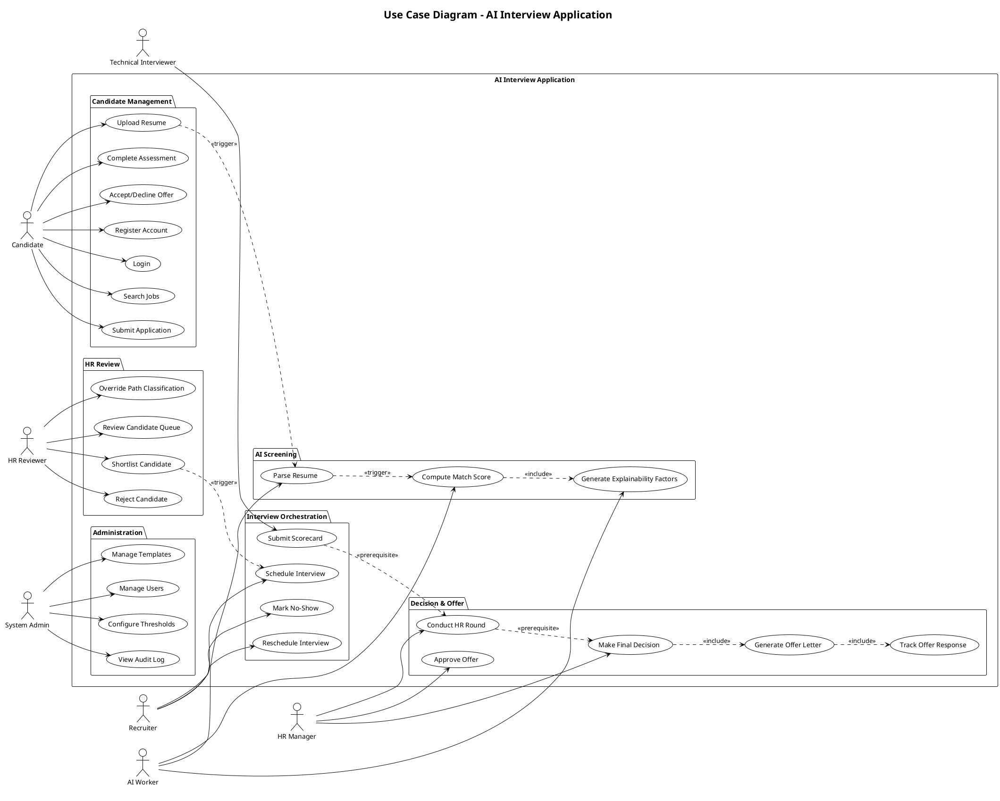
```plantuml
@startuml Use Case Diagram
!theme plain
title Use Case Diagram - AI Interview Application

left to right direction

actor "Candidate" as Candidate
actor "Recruiter" as Recruiter
actor "HR Reviewer" as HRReviewer
actor "Technical Interviewer" as TechInterviewer
actor "HR Manager" as HRManager
actor "System Admin" as Admin
actor "AI Worker" as AIWorker

rectangle "AI Interview Application" {
  
  package "Candidate Management" {
    usecase "Register Account" as UC1
    usecase "Login" as UC2
    usecase "Search Jobs" as UC3
    usecase "Submit Application" as UC4
    usecase "Upload Resume" as UC5
    usecase "Complete Assessment" as UC6
    usecase "Accept/Decline Offer" as UC7
  }
  
  package "AI Screening" {
    usecase "Parse Resume" as UC8
    usecase "Compute Match Score" as UC9
    usecase "Generate Explainability Factors" as UC10
  }
  
  package "HR Review" {
    usecase "Review Candidate Queue" as UC11
    usecase "Shortlist Candidate" as UC12
    usecase "Reject Candidate" as UC13
    usecase "Override Path Classification" as UC14
  }
  
  package "Interview Orchestration" {
    usecase "Schedule Interview" as UC15
    usecase "Submit Scorecard" as UC16
    usecase "Mark No-Show" as UC17
    usecase "Reschedule Interview" as UC18
  }
  
  package "Decision & Offer" {
    usecase "Conduct HR Round" as UC19
    usecase "Make Final Decision" as UC20
    usecase "Approve Offer" as UC21
    usecase "Generate Offer Letter" as UC22
    usecase "Track Offer Response" as UC23
  }
  
  package "Administration" {
    usecase "Manage Users" as UC24
    usecase "Configure Thresholds" as UC25
    usecase "View Audit Log" as UC26
    usecase "Manage Templates" as UC27
  }
}

Candidate --> UC1
Candidate --> UC2
Candidate --> UC3
Candidate --> UC4
Candidate --> UC5
Candidate --> UC6
Candidate --> UC7

AIWorker --> UC8
AIWorker --> UC9
AIWorker --> UC10

HRReviewer --> UC11
HRReviewer --> UC12
HRReviewer --> UC13
HRReviewer --> UC14

Recruiter --> UC15
Recruiter --> UC17
Recruiter --> UC18

TechInterviewer --> UC16

HRManager --> UC19
HRManager --> UC20
HRManager --> UC21

UC20 ..> UC22 : <<include>>
UC22 ..> UC23 : <<include>>

Admin --> UC24
Admin --> UC25
Admin --> UC26
Admin --> UC27

UC5 ..> UC8 : <<trigger>>
UC8 ..> UC9 : <<trigger>>
UC9 ..> UC10 : <<include>>

UC12 ..> UC15 : <<trigger>>
UC16 ..> UC19 : <<prerequisite>>
UC19 ..> UC20 : <<prerequisite>>

@enduml
```

---

## 12. Activity Diagrams

### 12.1 Interview Orchestration - Dual Path Activity

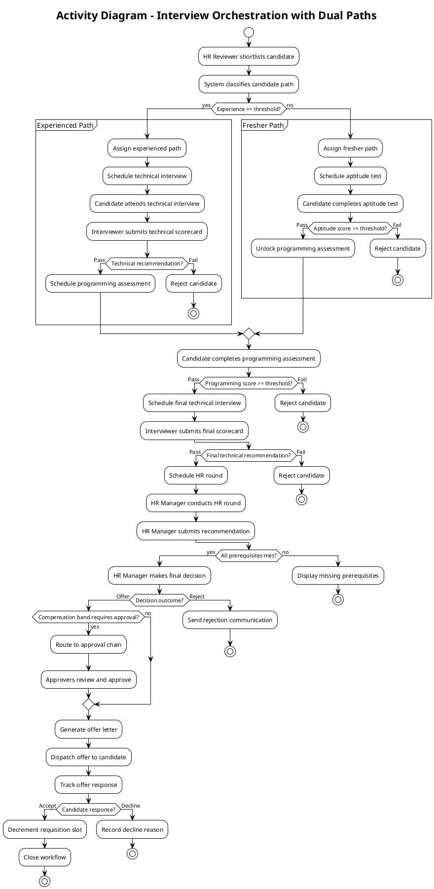
```plantuml
@startuml Interview Orchestration Activity
!theme plain
title Activity Diagram - Interview Orchestration with Dual Paths

start

:HR Reviewer shortlists candidate;

:System classifies candidate path;

if (Experience >= threshold?) then (yes)
  partition "Experienced Path" {
    :Assign experienced path;
    :Schedule technical interview;
    :Candidate attends technical interview;
    :Interviewer submits technical scorecard;
    
    if (Technical recommendation?) then (Pass)
      :Schedule programming assessment;
    else (Fail)
      :Reject candidate;
      stop
    endif
  }
else (no)
  partition "Fresher Path" {
    :Assign fresher path;
    :Schedule aptitude test;
    :Candidate completes aptitude test;
    
    if (Aptitude score >= threshold?) then (Pass)
      :Unlock programming assessment;
    else (Fail)
      :Reject candidate;
      stop
    endif
  }
endif

:Candidate completes programming assessment;

if (Programming score >= threshold?) then (Pass)
  :Schedule final technical interview;
  :Interviewer submits final scorecard;
else (Fail)
  :Reject candidate;
  stop
endif

if (Final technical recommendation?) then (Pass)
  :Schedule HR round;
  :HR Manager conducts HR round;
  :HR Manager submits recommendation;
else (Fail)
  :Reject candidate;
  stop
endif

if (All prerequisites met?) then (yes)
  :HR Manager makes final decision;
  
  if (Decision outcome?) then (Offer)
    if (Compensation band requires approval?) then (yes)
      :Route to approval chain;
      :Approvers review and approve;
    else (no)
    endif
    
    :Generate offer letter;
    :Dispatch offer to candidate;
    :Track offer response;
    
    if (Candidate response?) then (Accept)
      :Decrement requisition slot;
      :Close workflow;
      stop
    else (Decline)
      :Record decline reason;
      stop
    endif
  else (Reject)
    :Send rejection communication;
    stop
  endif
else (no)
  :Display missing prerequisites;
  stop
endif

@enduml
```

### 12.2 Communication Retry Activity

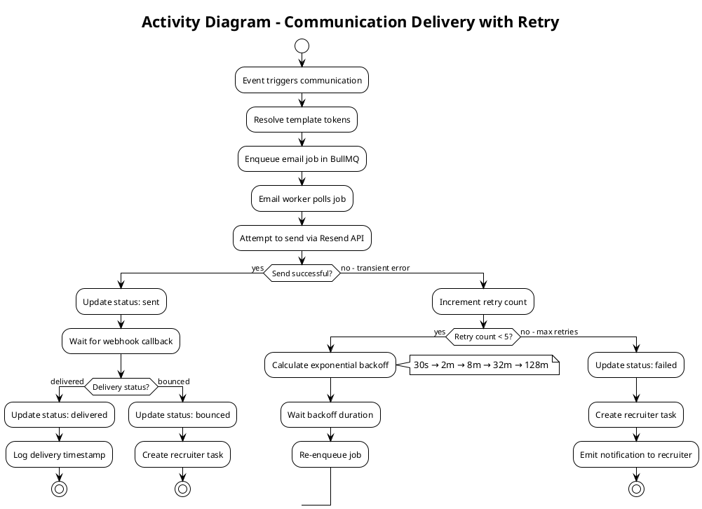
```plantuml
@startuml Communication Retry Activity
!theme plain
title Activity Diagram - Communication Delivery with Retry

start

:Event triggers communication;
:Resolve template tokens;
:Enqueue email job in BullMQ;

:Email worker polls job;
:Attempt to send via Resend API;

if (Send successful?) then (yes)
  :Update status: sent;
  :Wait for webhook callback;
  
  if (Delivery status?) then (delivered)
    :Update status: delivered;
    :Log delivery timestamp;
    stop
  else (bounced)
    :Update status: bounced;
    :Create recruiter task;
    stop
  endif
else (no - transient error)
  :Increment retry count;
  
  if (Retry count < 5?) then (yes)
    :Calculate exponential backoff;
    note right
      30s → 2m → 8m → 32m → 128m
    end note
    :Wait backoff duration;
    :Re-enqueue job;
  else (no - max retries)
    :Update status: failed;
    :Create recruiter task;
    :Emit notification to recruiter;
    stop
  endif
endif

@enduml
```

---

## 13. WebSocket Communication Diagram

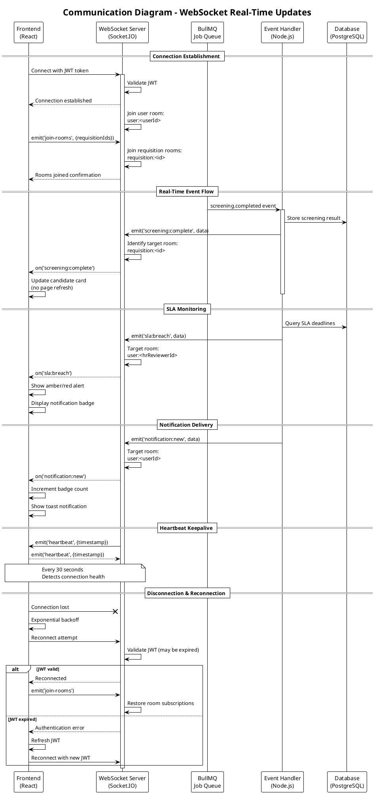
```plantuml
@startuml WebSocket Communication
!theme plain
title Communication Diagram - WebSocket Real-Time Updates

participant "Frontend\n(React)" as Frontend
participant "WebSocket Server\n(Socket.IO)" as WS
participant "BullMQ\nJob Queue" as Queue
participant "Event Handler\n(Node.js)" as Handler
participant "Database\n(PostgreSQL)" as DB

== Connection Establishment ==

Frontend -> WS: Connect with JWT token
activate WS
WS -> WS: Validate JWT
WS --> Frontend: Connection established
WS -> WS: Join user room:\nuser:<userId>

Frontend -> WS: emit('join-rooms', {requisitionIds})
WS -> WS: Join requisition rooms:\nrequisition:<id>
WS --> Frontend: Rooms joined confirmation

== Real-Time Event Flow ==

Queue -> Handler: screening.completed event
activate Handler
Handler -> DB: Store screening result
Handler -> WS: emit('screening:complete', data)
WS -> WS: Identify target room:\nrequisition:<id>
WS --> Frontend: on('screening:complete')
Frontend -> Frontend: Update candidate card\n(no page refresh)
deactivate Handler

== SLA Monitoring ==

Handler -> DB: Query SLA deadlines
Handler -> WS: emit('sla:breach', data)
WS -> WS: Target room:\nuser:<hrReviewerId>
WS --> Frontend: on('sla:breach')
Frontend -> Frontend: Show amber/red alert
Frontend -> Frontend: Display notification badge

== Notification Delivery ==

Handler -> WS: emit('notification:new', data)
WS -> WS: Target room:\nuser:<userId>
WS --> Frontend: on('notification:new')
Frontend -> Frontend: Increment badge count
Frontend -> Frontend: Show toast notification

== Heartbeat Keepalive ==

WS -> Frontend: emit('heartbeat', {timestamp})
Frontend --> WS: emit('heartbeat', {timestamp})
note over WS,Frontend
  Every 30 seconds
  Detects connection health
end note

== Disconnection & Reconnection ==

Frontend -x WS: Connection lost
Frontend -> Frontend: Exponential backoff
Frontend -> WS: Reconnect attempt
WS -> WS: Validate JWT (may be expired)
alt JWT valid
  WS --> Frontend: Reconnected
  Frontend -> WS: emit('join-rooms')
  WS -> WS: Restore room subscriptions
else JWT expired
  WS --> Frontend: Authentication error
  Frontend -> Frontend: Refresh JWT
  Frontend -> WS: Reconnect with new JWT
end

deactivate WS

@enduml
```

---

## 14. Model Summary

### 14.1 Diagram Index

| Diagram Type | Section | Purpose |
| --- | --- | --- |
| **System Context** | Section 2 | Shows the system boundary and external interactions |
| **Component** | Section 3 | Illustrates internal architecture and component relationships |
| **Deployment** | Section 4 | Details physical deployment across cloud infrastructure |
| **Data Flow** | Section 5 | Visualizes data movement through key workflows |
| **ERD** | Section 6 | Defines data model and entity relationships |
| **Sequence** | Section 7 | Shows time-ordered interactions for critical flows |
| **State Machine** | Section 8 | Models application and interview stage lifecycles |
| **Class** | Section 9 | Represents domain model with classes and relationships |
| **Timing** | Section 10 | Illustrates SLA monitoring over time |
| **Use Case** | Section 11 | Shows actors and their interactions with the system |
| **Activity** | Section 12 | Visualizes complex workflows with decision points |
| **WebSocket Communication** | Section 13 | Details real-time event flow and room-based broadcasting |

### 14.2 Key Design Decisions Visualized

1. **Event-Driven Architecture**: Demonstrated in data flow diagrams showing job queues and asynchronous processing
2. **CQRS Pattern**: Implied in component separation between write services and analytics worker
3. **Microservices Decomposition**: Shown in component diagram with distinct service boundaries
4. **AI Worker Isolation**: Separate Python worker for AI processing, communicating via job queue
5. **External Integration Points**: Clear boundaries with Supabase, Resend, Assessment Provider in deployment
6. **Audit Trail**: Immutable audit_events table in ERD with relationships to all key entities
7. **Approval Workflow**: Multi-tier approval chain shown in decision sequence diagram
8. **State Transitions**: Comprehensive state machines for application and interview lifecycles
9. **Dual Interview Paths**: Activity diagram shows fresher vs. experienced path branching logic
10. **Real-Time Updates**: WebSocket communication diagram shows room-based event broadcasting
11. **Retry Mechanisms**: Activity diagram illustrates exponential backoff for failed communications
12. **Actor Interactions**: Use case diagram provides comprehensive view of all system interactions

---

## 15. Appendices

### Appendix A: Notation Guide

**PlantUML Notation Used:**
- `@startuml` / `@enduml`: Diagram boundaries
- `!include`: C4 model library references
- `actor`: Human users and external systems
- `participant`: System components in sequence/communication diagrams
- `entity`: Database tables
- `class`: Domain objects
- `state`: State machine states
- `usecase`: Use case bubbles
- `partition`: Activity grouping in activity diagrams
- `-->`: Synchronous interactions
- `->`: Asynchronous messages
- `..>`: Dependencies (include, extend, trigger, prerequisite)
- `--`: Relationships

### Appendix B: Reference Documents

- **Source Specification**: SPEC-AI-INTERVIEW-001 v1.0
- **Architecture Design**: DESIGN-AI-INTERVIEW-001 v1.0
- **C4 Model**: Simon Brown's C4 Model for Software Architecture
- **PlantUML**: https://plantuml.com/
- **Socket.IO Protocol**: https://socket.io/docs/v4/
- **UML 2.5 Specification**: OMG Unified Modeling Language

### Appendix C: Diagram Rendering

All PlantUML diagrams can be rendered using:
- PlantUML CLI: `plantuml model.md`
- Online: https://www.plantuml.com/plantuml/
- VS Code PlantUML Extension
- IntelliJ PlantUML Plugin

**Command-line rendering:**
```bash
# Install PlantUML (requires Java)
brew install plantuml  # macOS
apt-get install plantuml  # Ubuntu/Debian

# Render all diagrams
plantuml model.md

# Render to specific format
plantuml -tpng model.md
plantuml -tsvg model.md
```

---

**End of Document**
