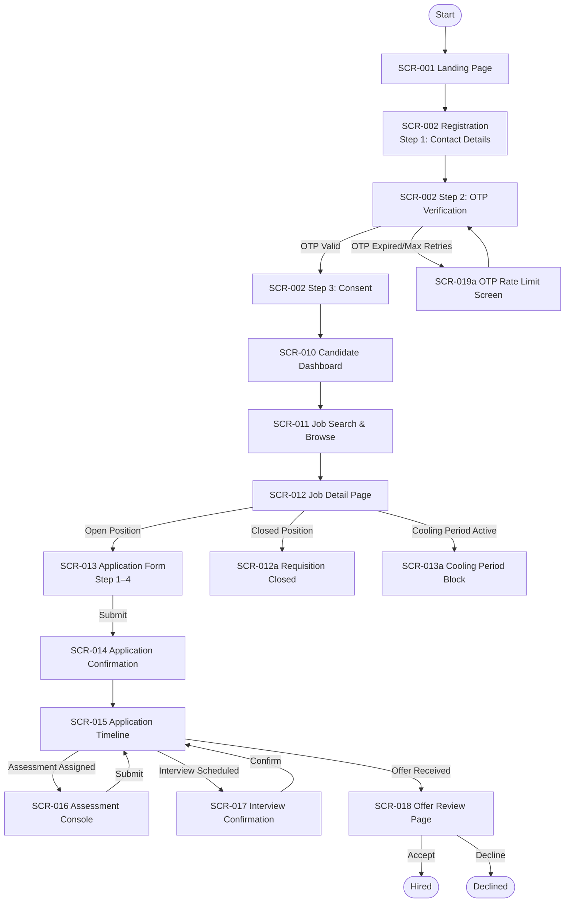
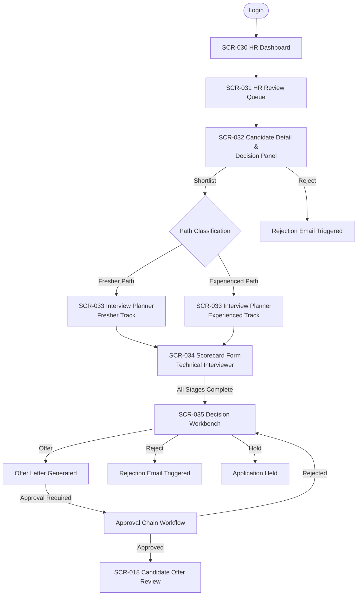
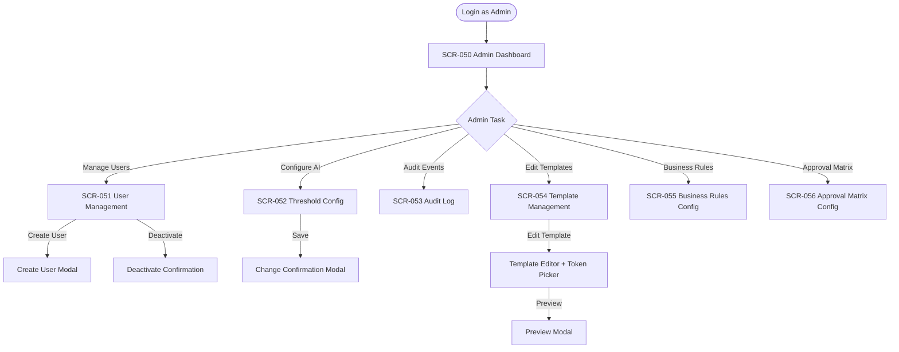
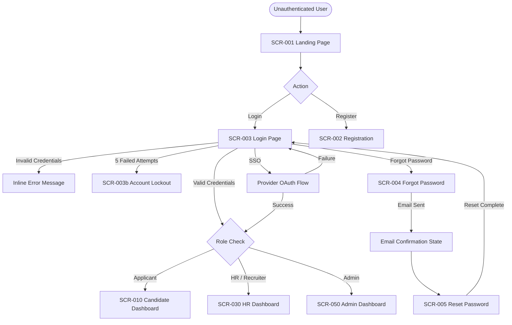

# Navigation Map

## Document Control

| Field | Value |
| --- | --- |
| Artifact | wireframe / navigation-map |
| Project | AI Interview Application |
| Source | FIGMA-SPEC-AI-INTERVIEW-001 v1.0 |
| Date | 2026-07-22 |
| Status | Draft |

---

## 1. User Journey Flows

### 1.1 Candidate Registration & Application Flow



### 1.2 HR Review & Decision Flow



### 1.3 Admin Configuration Flow



### 1.4 Authentication Flow



---

## 2. Screen Transition Matrix

| From Screen | User Action | To Screen |
| --- | --- | --- |
| SCR-001 Landing | Click "Apply as Candidate" | SCR-002 Registration |
| SCR-001 Landing | Click "Login" | SCR-003 Login |
| SCR-003 Login | Submit valid credentials | Role-specific dashboard |
| SCR-003 Login | Click "Forgot password?" | SCR-004 Forgot Password |
| SCR-003 Login | Click "Sign up" | SCR-002 Registration |
| SCR-002 Registration | Complete Step 3 | SCR-010 Candidate Dashboard |
| SCR-010 Candidate Dashboard | Click "Browse open positions" | SCR-011 Job Search |
| SCR-011 Job Search | Click job card | SCR-012 Job Detail |
| SCR-012 Job Detail | Click "Apply" | SCR-013 Application Form |
| SCR-013 Application Form | Submit form | SCR-014 Confirmation |
| SCR-014 Confirmation | Click "View application timeline" | SCR-015 Application Timeline |
| SCR-015 Timeline | Click "Complete assessment" | SCR-016 Assessment Console |
| SCR-015 Timeline | Click "Schedule interview" | SCR-017 Interview Confirmation |
| SCR-015 Timeline | Click "Review offer" | SCR-018 Offer Review |
| SCR-030 HR Dashboard | Click "Pending Reviews" card | SCR-031 HR Review Queue |
| SCR-031 HR Queue | Click candidate row | SCR-032 Candidate Detail |
| SCR-032 Candidate Detail | Click "Shortlist" | SCR-033 Interview Planner |
| SCR-033 Interview Planner | Click "View scorecard" | SCR-034 Scorecard Form |
| SCR-033 Interview Planner | All stages complete | SCR-035 Decision Workbench |
| SCR-035 Decision Workbench | Click "Offer" | Offer letter flow |
| SCR-050 Admin Dashboard | Click "Manage Users" | SCR-051 User Management |
| SCR-050 Admin Dashboard | Click "Configure Thresholds" | SCR-052 Threshold Config |
| SCR-050 Admin Dashboard | Click "View Audit Log" | SCR-053 Audit Log |
| SCR-050 Admin Dashboard | Click "Manage Templates" | SCR-054 Template Management |

---

## 3. Modal & Overlay Inventory

| ID | Trigger | Parent Screen | Purpose |
| --- | --- | --- | --- |
| MOD-001 | Inactivity (25 min) | Any authenticated screen | Session Timeout Warning |
| MOD-002 | Click "Shortlist" in Decision Panel | SCR-032 | Shortlist Confirmation |
| MOD-003 | Click "Reject" in Decision Panel | SCR-032 | Reject Confirmation |
| MOD-004 | Click "Accept Offer" in Offer Review | SCR-018 | Offer Accept Confirmation |
| MOD-005 | Click "Decline Offer" in Offer Review | SCR-018 | Offer Decline Confirmation |
| MOD-006 | Click "Bulk Reject" in HR Queue | SCR-031 | Bulk Reject Confirmation |
| MOD-007 | Click "Save" in Threshold Config | SCR-052 | Threshold Change Confirmation |
| MOD-008 | Click "Delete data" in Privacy | SCR-019 | Data Deletion Confirmation |
| MOD-009 | Click "Submit" in Assessment | SCR-016 | Assessment Submit Confirmation |
| MOD-010 | Click audit event row | SCR-053 | Event Detail (JSON payload) |
| MOD-011 | Click token picker in template editor | SCR-054 | Token Picker |
| MOD-012 | Click "Preview" in template editor | SCR-054 | Template Preview |
| MOD-013 | Click "Create user" | SCR-051 | Create User |

---

## 4. Notification & Alert Pathways

```
System Events → Alert Types
├── SLA breach detected          → System-wide SLA Breach Banner (SCR-030, SCR-031)
├── AI fallback mode activated   → AI Fallback Mode Banner (all HR screens)
├── Email service degraded       → Email Service Down Banner (all HR screens)
├── New application submitted    → Real-time notification bell
├── Candidate shortlisted        → Email notification + activity feed update
├── Interview scheduled          → Email to candidate + calendar invite
├── Offer dispatched             → Email to candidate
└── Decision submitted           → Audit log entry + activity feed
```

---

## 5. Deep Link Entry Points

| Entry Point | Route Pattern | Context |
| --- | --- | --- |
| Candidate email link — Interview confirm | `/candidate/interviews/:id/confirm` | From interview invitation email |
| Candidate email link — Offer review | `/candidate/offers/:id` | From offer dispatched email |
| Candidate email link — Assessment | `/candidate/assessments/:id` | From assessment invitation email |
| Reset password link | `/reset-password?token=xxx` | From forgot password email |
| OTP verification | `/register?step=otp` | From registration OTP email/SMS |
| HR overdue queue deeplink | `/hr/queue?filter=sla_breached` | From SLA breach email alert |
